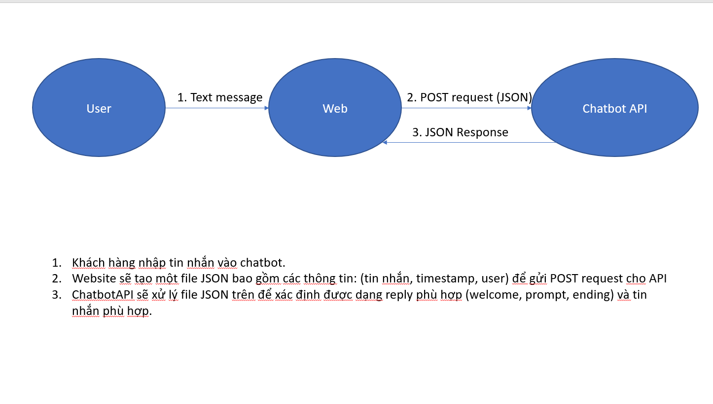

# Chatbot API(GoLang)
## 1.Inputs
**A POST request that has the content of a JSON file describing the fields of inputs.**  
Example:
```JSON
{
    "text": "hi",
    "fromUser": "linh"
}
```
## 2.Outputs
**A JSON response from the API specifying the the reply from the bot..**  
Example:
```JSON
{
    "reply": "Hi! How are you doing?",
    "action": output.Welcome,
    "toUser": "Linh",
    "timeStamp": time,
}
```
## 3.Dataflow

## 4.Implementation
<!-- ### **4.1 Instance of a chatbot worker**
**What is a chatbot worker?**  
A chatbot worker is an instance that has multiple **Intent**.  
**Why does this instance exist?**  
Since multiple web applications will invoke this API, its best that their back-end can create their own instance of the chatbot. -->
### **4.1 Instance of an Intent**
**What is an Intent?**  
An intent is a mechanics that is the API uses to detect what to reply  
**What does an Intent have?**  
***IntentName***: Name of the Intent  
***IntentTrainingPhrases***: Phrases that the end-point user might use  
***Reply***: An array of messages of what to reply or of prompts  
### **4.2 Creating an Intent**
### **4.3 Modifying an Intent**
### **4.4 Deleting an Intent**